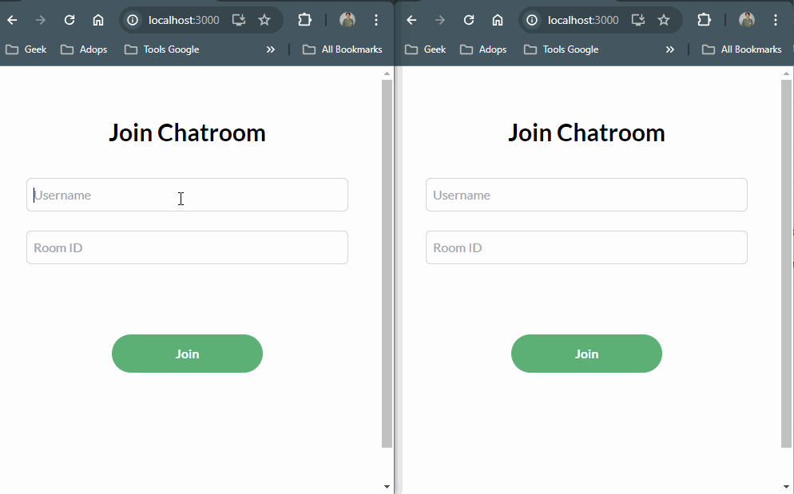

# joinchat

### Project Requirement: 
- **Frontend:** Reactjs version 
- **Backend:** Nodejs version + mongodb
- for real-time messaging using socket.io

### Submission Guideline:
- Date of submission  
  ***Friday, 12 April 2024***

- Instruction to run assignment locally  
  ***a. Frontend: to running frontend in locally can follow this intructions [(docs frontend)](./frontend/README.md)***  
  ***b. Backend: to running backend in locally can follow this intructions [(docs backend)](./backend/README.md)***

- Time spent  
  ***I'm spent 2 days to complete this assignment, day 1 for frontend and day 2 for backend.***  

- Assumptions made  
  ***a. In the apps I'm develop users cannot join the chat room if username have been used before.***   
  ***b. In the apps I'm develop users cannot send message without filled username and room.***  
  ***c. when users first join will be receive some message from bot and users will be notified if have any users joined in the room.***  
  ***d. In the room users can broadcast message to all users joined in the same room.***   

- Shortcut/Compromises made  
  ***for the shortcut to solved the challenge assignment I'm using the mongodb as the database, and I'm using the socket.io for the real-time messaging. mongodb save the data in the database when accessing the apps user will be see the chat history.***

- Assume your application will go into production  
  ***a. before deploying into production makesure performance should be maintenance if have lot of users or thread chat***    
  ***b. fixing bugs about security, an test with several scenario***

- What did you not include in your solution that you want us to know about? were you short on time and not able to include something that you want us to know about? please list it here so that we know that you considered it
***a. styles of bubble chat need to improve based on the design figma a little bit***  
***b. handle connection socket when reload page need to improvement***

- Other information about your submission that you feel it's important that we know if applicable.  
  ***didn't' have any information***

- Your feedback on this technical challenge  
  ***the technical challenge with real case, I'm enjoy to solved the challenge and overall my feedback is go ahead, and sofar is awesome***