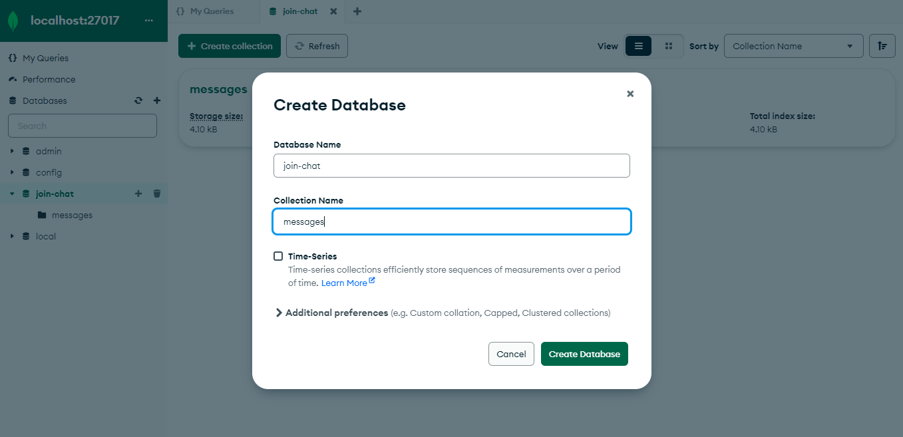

# joinchat Backend
This project was bootstrapped with node, express and mongodb.

## Available Scripts
In the project directory, you can run:  

### `npm install`
Installing dependency for the app.  

### `npm run start`
Runs the app in the production mode.  

### `npm run dev`
The page will reload if you make edits.  
You will also see any lint errors in the console.

## Requirement
- To running the apps recommended using nodejs version using 16.x.x up to 
- Mongodb standalone in your locally
- Filled the ***.env.example*** and edit to the ***.env*** file
  ```
    // environment mongo database
    MONGO_URL='localhost:27017'
    MONGO_DB_NAME=join-chat

    // environment port
    PORT=3001

    // URL client frontend
    URL_CLIENT='http://localhost:3000'
  ```
- Create database mongodb :
  

  ## Example code snippet API
  a. Create message
  ```
  var request = require('request');
  var options = {
    'method': 'POST',
    'url': 'http://localhost:3001/api/v1/create',
    'headers': {
      'Content-Type': 'application/json'
    },
    body: JSON.stringify({
      "username": "risyandi94",
      "message": "lorem ipsum lorem ipsumlorem ipsum asdasd",
      "room": "ruang-guru"
    })

  };
  request(options, function (error, response) {
    if (error) throw new Error(error);
    console.log(response.body);
  });
  ```
  
  B. Message by room
  ```
  var request = require('request');
  var options = {
    'method': 'POST',
    'url': 'http://localhost:3001/api/v1/message',
    'headers': {
      'Content-Type': 'application/json'
    },
    body: JSON.stringify({
      "room": "ruang-guru"
    })

  };
  request(options, function (error, response) {
    if (error) throw new Error(error);
    console.log(response.body);
  });
  ```

  C. Checking username exist in room
  ```
  var request = require('request');
  var options = {
    'method': 'POST',
    'url': 'http://localhost:3001/api/v1/username-message',
    'headers': {
      'Content-Type': 'application/json'
    },
    body: JSON.stringify({
      "username": "risyandi94"
    })

  };
  request(options, function (error, response) {
    if (error) throw new Error(error);
    console.log(response.body);
  });
  ```